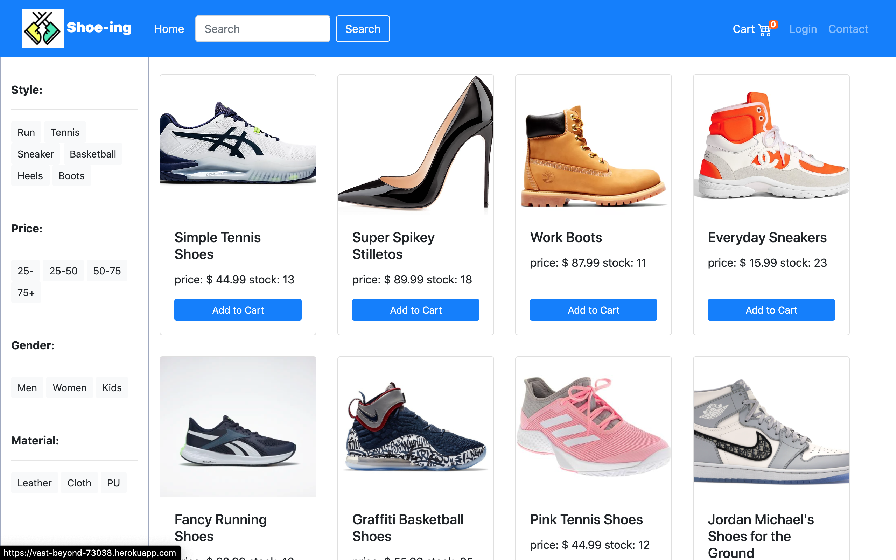

# Project_2

## Team: Super Group

## Project Overview

To become a full-stack web developer,we need to feature high-quality deployed examples of your work—-and use the finish projects for that very purpose. 

## Languages and Libraries:

* HTML
* CSS
* JavaScript
* jQuery
* Google
* W3school
* Express
* Node
* Bootstrap

## User story:

Shoes!!!!! It's for everyone! No matter who you are,where you are, how old you are....Everybody need a pair of shoes! We try to make a shoe ecommerce shopping website to attract your eyes and purchace shoes with us.Shoe-ing is representing what you are looking for in our responsive website....finding your desire shoes.

## User Functionality:
User can enter their search to find specific shoes they are looking for.
User can use different categories to find certain types of the shoes they are looking for.
Users can review the details of each shoes and add into the cart.
Users can login/ signup to make the cart work for adding items and logout from different user names.
Users can organize the cart and add/remove items.
Users also can checkout to finish the purchase and check the orders.
​
## Process:
This project fulfills the following requirements:
​
* Use Node.js and Express.js to create a RESTful API.

* Optional - Use Handlebars.js as the template engine.

* Use MySQL and the Sequelize ORM for the database.

* Have both GET and POST routes for retrieving and adding new data.

* Use at least one new library, package, or technology that we haven’t discussed.

* Have a folder structure that meets the MVC paradigm.

* Include authentication (express-session and cookies).

* Protect API keys and sensitive information with environment variables.

* Be deployed using Heroku (with data).

* Have a polished UI.

* Be responsive.

* Be interactive (i.e., accept and respond to user input).

* Meet good-quality coding standards (file structure, naming conventions, follows best practices for class/id naming conventions, indentation, quality comments, etc.).

* Have a professional README (with unique name, description, technologies used, screenshot, and link to deployed application).

[Heroku](https://vast-beyond-73038.herokuapp.com/)

## Developers:

### Shuting Zhao  
* Github: https://github.com/zst199394  
* Contact: zst9394@outlook.com

### Ethan  
* Github: https://github.com/edutcher   
* Contact: edutcher@gmail.com

### Michael 
* Github:  https://github.com/m-whitmer/
* Contact: whitmer81@gmail.com
